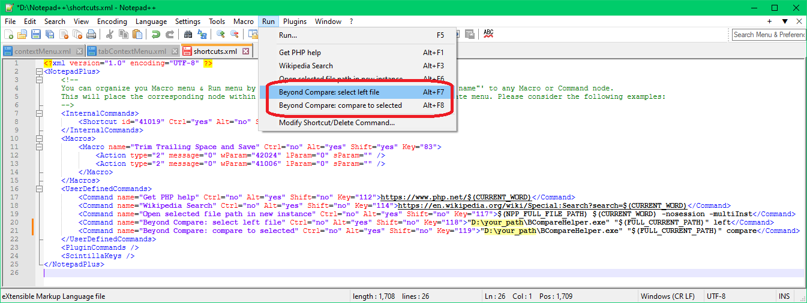
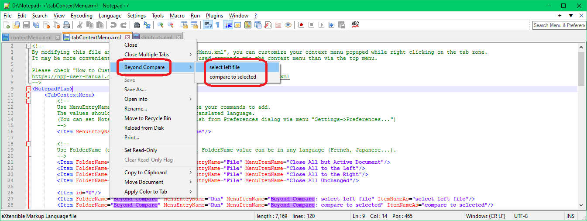
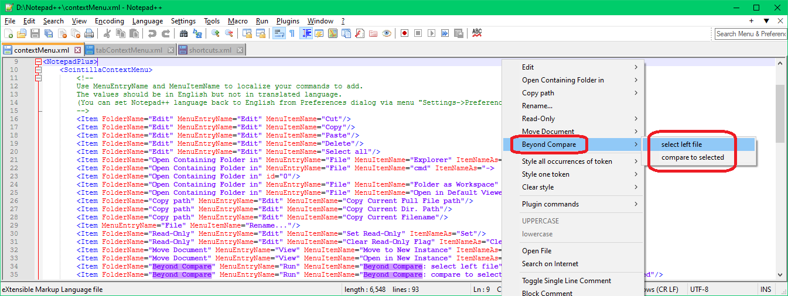

# BCompareHelper

See https://forum.scootersoftware.com/forum/beyond-compare-4-discussion/general/92292-select-left-file-from-command-line

# Usage

BCompareHelper.exe <file/directory path> left|compare [debug]

 - left    => "Select Left File"
 - compare => "Compare to"
 - debug   => "keep debug console open"

# Integration with Notepad++

1. open shortcuts.xml from your Notepad++ installation and add 2 lines as below in the \<UserDefinedCommands\> section, where "D:\your_path" must be replaced with real path to your BCompareHelper.exe:

        <Command name="Beyond Compare: select left file" Ctrl="no" Alt="yes" Shift="no" Key="118">"D:\your_path\BCompareHelper.exe" "$(FULL_CURRENT_PATH)" left</Command>
        <Command name="Beyond Compare: compare to selected" Ctrl="no" Alt="yes" Shift="no" Key="119">"D:\your_path\BCompareHelper.exe" "$(FULL_CURRENT_PATH)" compare</Command>

2.  open tabContextMenu.xml from your Notepad++ installation and add 2 lines as below:

		<Item FolderName="Beyond Compare" MenuEntryName="Run" MenuItemName="Beyond Compare: select left file" ItemNameAs="select left file"/>
		<Item FolderName="Beyond Compare" MenuEntryName="Run" MenuItemName="Beyond Compare: compare to selected" ItemNameAs="compare to selected"/>

3. open contextMenu.xml from your Notepad++ installation and add 2 lines as below:

		<Item FolderName="Beyond Compare" MenuEntryName="Run" MenuItemName="Beyond Compare: select left file" ItemNameAs="select left file"/>
		<Item FolderName="Beyond Compare" MenuEntryName="Run" MenuItemName="Beyond Compare: compare to selected" ItemNameAs="compare to selected"/>

# TODO

1. if "debug" then log to a file too (also show message dialogs maybe if "debug-ui"?)
2. always open/run hidden (don't open any console, unless "debug" or if wrong parameters to show usage and only then reopen the console)
3. add config file for reg keys, and BCompare location if not known
4. automatically increment version and add build date
5. add test cases?
